# MOLAB
> MOLAB(모두의 리빙랩)은 국내 스마트시티 커뮤니티 플랫폼입니다.
> 한국의 스마트시티 프로젝트는 시민 참여가 부족하다는 문제점을 해결해보고자 시작한, 스마트시티 분야의 네트워킹을 지원하는 웹 플랫폼입니다.
> 관련 뉴스: https://www.ohmynews.com/NWS_Web/View/at_pg.aspx?CNTN_CD=A0002618618


## Table of Contents
* [Technologies Used](#technologies-used)
* [Features](#features)
* [Usage](#usage)
* [DEMO](#DEMO)


## Technologies Used
- next - v13.4.12
- wysiwyg - v1.15.0
- react - v18.2.0
- react-hook-form - v7.45.1
- tailwind - v3.3.2
- typescript - v5.1.3
- tanstack/react-query - v4.23.6
- supabase - latest


## Features
1) Living Lab Studio: 시민 대상 리빙랩 프로젝트를 쉽게 생성 할 수 있도록 개발한 React-Hook-Form과 wysiwyg 기반 에디터입니다.
2) 리빙랩 프로젝트 검색: 지자체와 시민이 올린 리빙랩 프로젝트를 키워드/카테고리 별로 검색하고 참여 후기를 작성할 수 있습니다.


## Usage
### Convension
- Commit Message: `<Category>(<Directory or FileName>)/<Description>`
- Branch Name: `<Category>/<Description>`
- Category:
  ```
  - feat: 기능 개발 (api 패치, 컴포넌트 개발 포함)
  - styles: 스타일에 관한 내용
  - chore: config, env, 패키지에 관한 내용
  - refactor: 리팩토링 관한 내용
  - migrate: 코드 마이그레이션에 관한 내용
  - fix: 버그 픽스에 관한 내용
  ```

### Directory
```
src
 ┣ app
 ┃ ┗ not-found: 404 페이지
 ┃ ┗ about-livinglab: 리빙랩 소개 페이지
 ┃ ┗ auth: supabase 기반 auth 설정 callback 처리
 ┃ ┗ api: 각종 api 스펙
 ┃ ┗ communication: 열린 참여 메인 / 디테일 페이지
 ┃ ┗ login: 로그인 / 회원가입 페이지
 ┃ ┗ mypage: 마이 페이지
 ┃ ┗ notice: 공고 메인 / 디테일 페이지
 ┃ ┗ project: 리빙랩 스튜디오 페이지
 ┃
 ┣ domain
 ┃ ┗ repositories: 데이터의 CRUD 작업을 정의 UseCase
 ┃ ┗ useCases: Repositories를 통해 데이터에 접근하여 필요한 작업을 수행
 ┃ 
 ┣ components
 ┃ ┗ blocks: 전체 페이지에서 사용하게 될 공통 컴포넌트 parts
 ┃ ┗ icons: 아이콘
 ┃ ┗ pages: 개별 페이지에서 사용하게될 컴포넌트
 ┃ 
 ┣ constants
 ┃ ┗ api: api 관련 에러 코드
 ┃ ┗ styles: tailwind 스타일 theme
 ┃
 ┣ store: atom 관리
 ┣ context: React.Context 관리
 ┣ hooks
 ┣ utils
 ┗ package.json
```

## DEMO
<details>
  <summary><b>리빙랩 스튜디오 (에디터)</b></summary>
  <div markdown="1">
    <ul>
      <li>리빙랩 스튜디오 사용방법</li>
      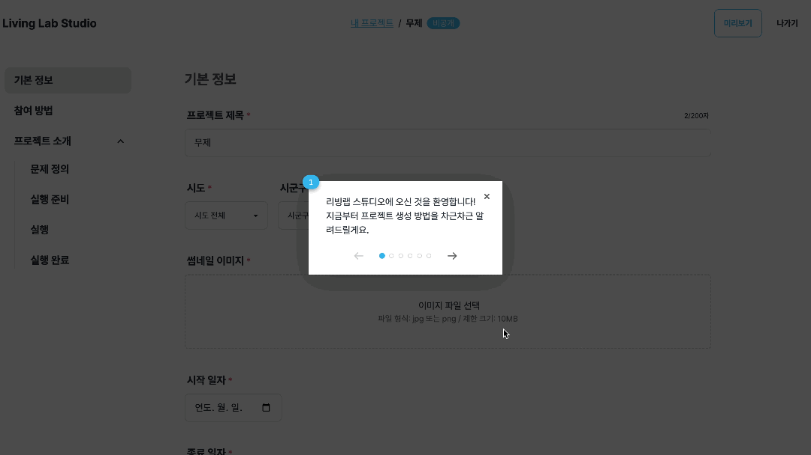
      <li>리빙랩 프로젝트 등록</li>
      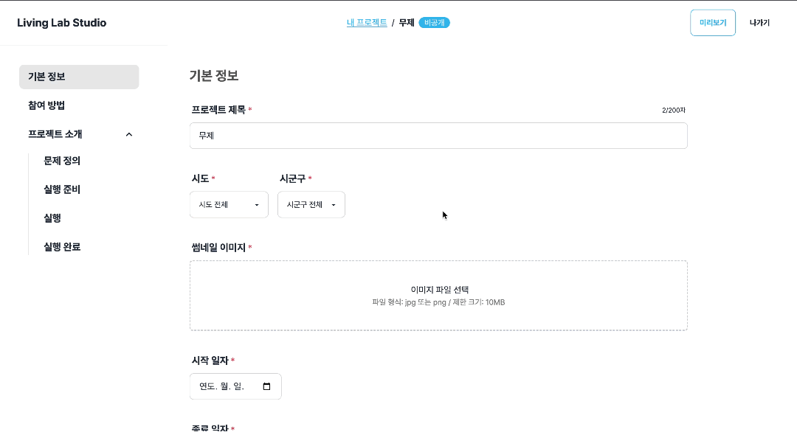
      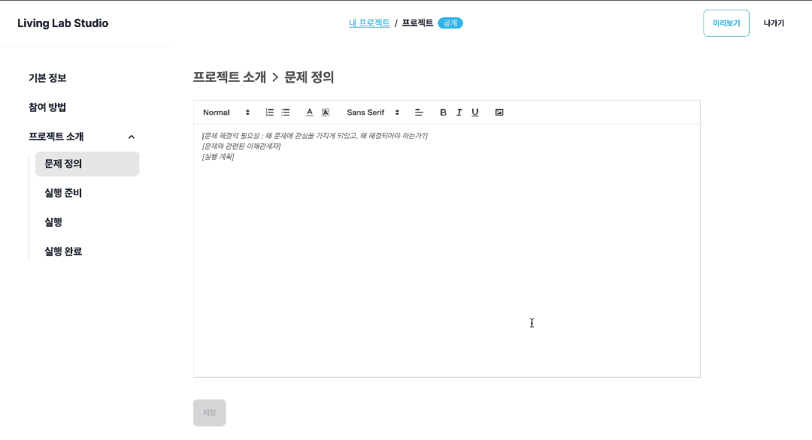
      <li>페이지 이탈 및 데이터 소실 방지</li>
      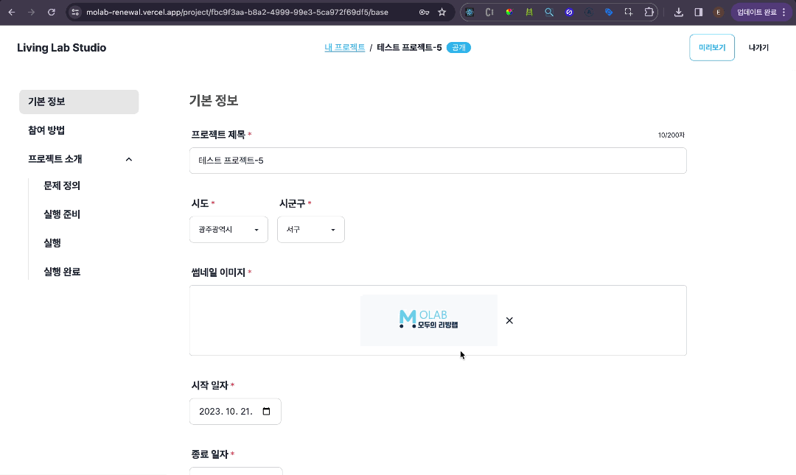
      <li>미리보기</li>
      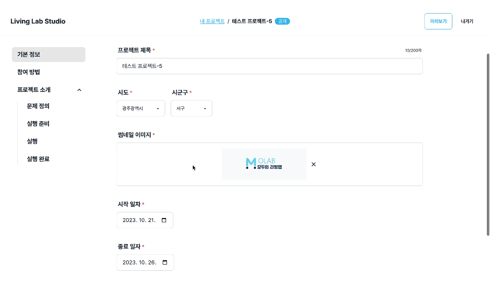
      <li>저장 내용 확인</li>
      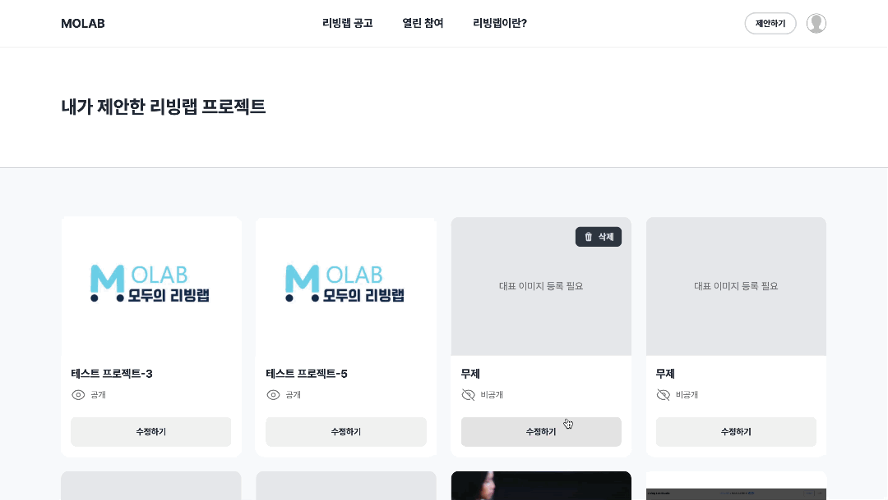
    </ul>
  </div>
</details>

<details>
  <summary><b>리빙랩 프로젝트 상세/검색</b></summary>
  <div markdown="2">
    <ul>
      <li>내가 생성한 프로젝트 Read/Delete</li>
      
      <li>공개 프로젝트 검색</li>
      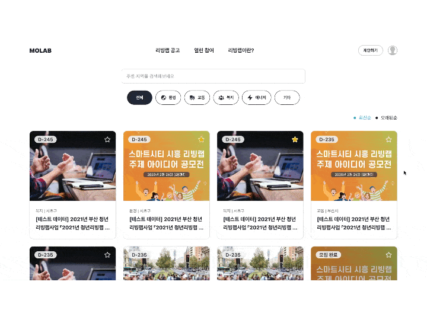
      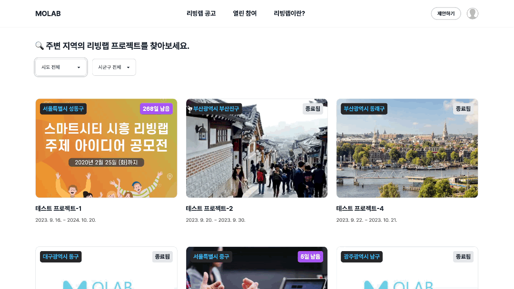
      <li>공개 프로젝트 북마크</li>
      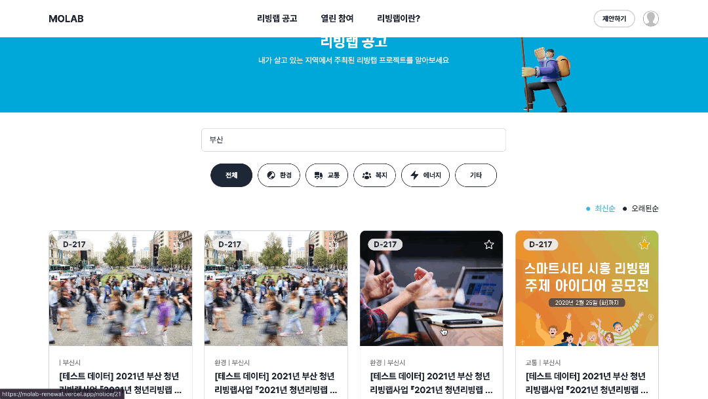
      <li>공개 프로젝트 상세보기</li>
      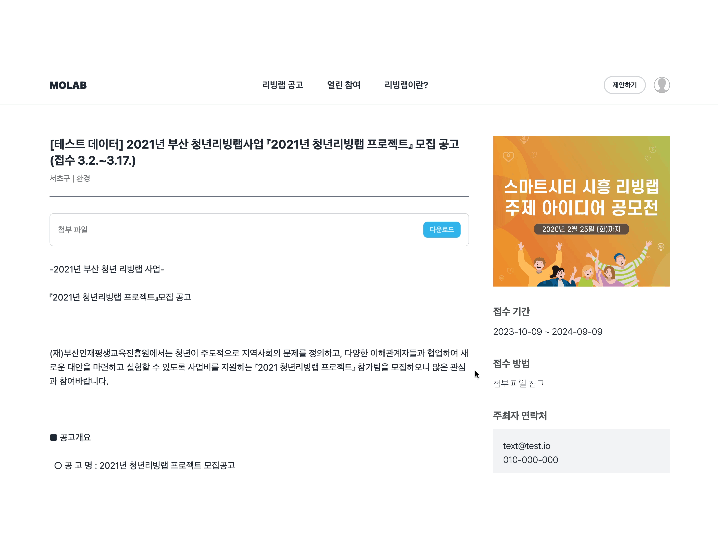
      <li>프로젝트 참여 후기 남기기</li>
      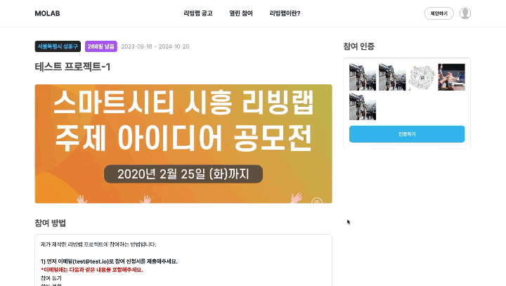
    </ul>
  </div>
</details>
